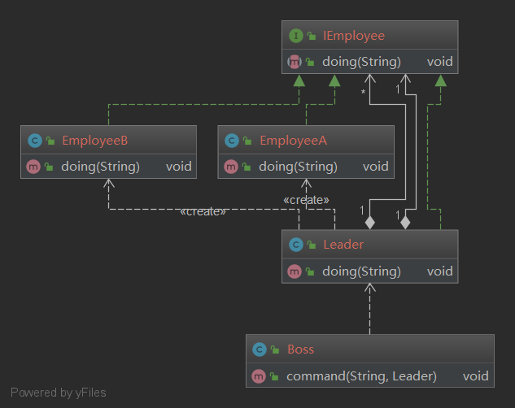
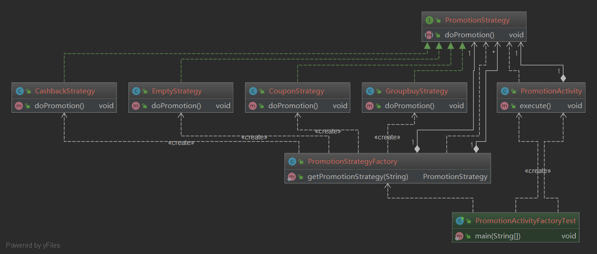

# 设计模式Demo

## 委派模式

### 定义
    
    委派模式(Delegate Pattern)的基本作用就是负责任务的调度和分配任务，和代理模式很像，可以看作是一种
    特殊情况下的静态代理的全权代理，但是代理模式注重过程，而委派模式注重结果。
   
### 委派模式类图

### 策略模式
 
 ### 定义
     
     策略模式(Strategy Pattern)是指定义了算法家族、分别封装起来，让它们之间可以互相替换，此模式让
     算法的变化不会影响到使用算法的用户。
     可以避免多重分支if...else...和switch语句。
    
 ### 策略模式类图
 
 

### 策略模式的适用场景

    1.假如系统有很多类，而它们的区别仅仅在于它们行为不同；
    2.一个系统需要动态地在几种算法中选择一种。

### 策略模式的优缺点

> 优点
    1.策略模式符合开闭原则。
    2.避免使用多重条件转移语句，如if...else...和switch语句。
    3.使用策略模式可以提高算法的保密性和安全性。

> 缺点
    1.客户端必须知道所有的策略，并且自行决定使用哪一个策略类；
    2.代码中会产生非常多的策略类，增加维护难度。
    
    
